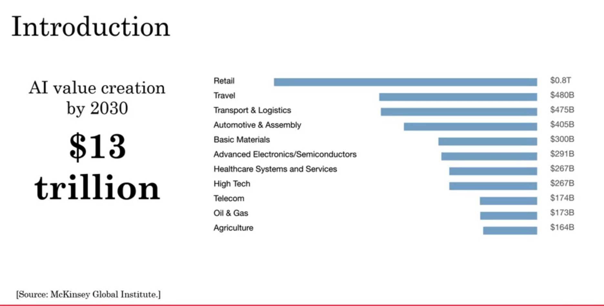
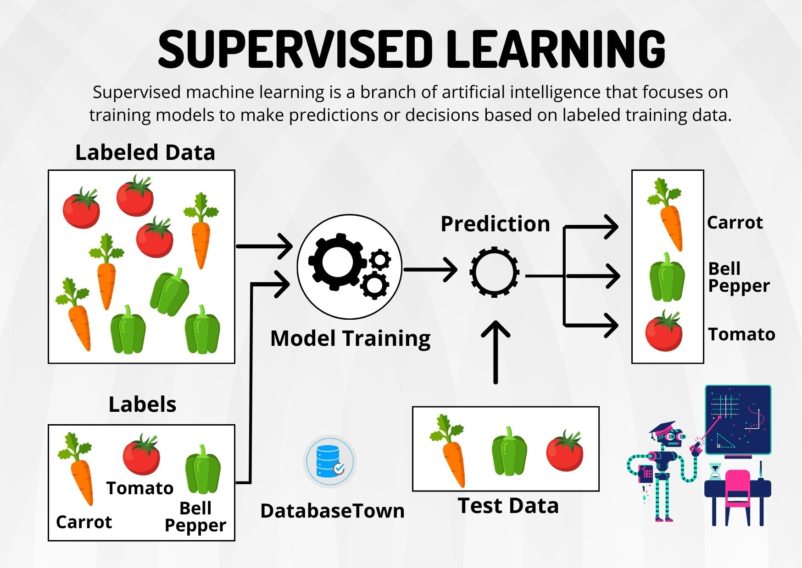

# Lecture 1: What is AI and its importance?

## In this lecture we will understand what is:

- Value Of AI
- AI
- Machine Learning
- API
 
 

# AI Value Creation By 2023 

# Artificail Intelligence
Artificail Intellignce is a *branch* of *Computer Science* concerned development of *methods* that *allow computers to learn withour explicit programming*.

# Machine Learning
Machine Learning is a branch of AI, which focuses on methods that can learn from examples and experience instead of relying on hard coded rules and make predictions on new data.

# Types Of Machine Learning

## 1 - Supervised Learning

## API:

Imagine you are an **API**

User asked you a question about **food** you don't know anything about **food**, but you know a **chef**.

So you will give that **user's** **request** a question in this case and ask the **chef** that question.

Chef will respond, then you take that **response** back to **user**

### Understand API example with flow:
User > You > Chef
 
User < You < Chef

### In reality:
**Request**:
User > API > Model
 
**Response**: User < API < Model
