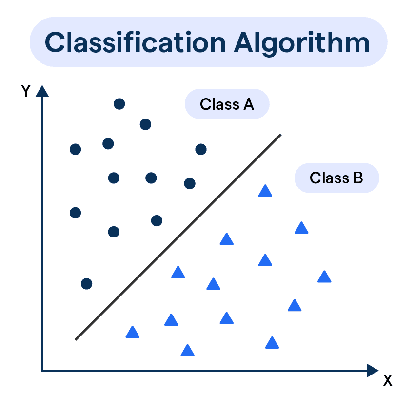
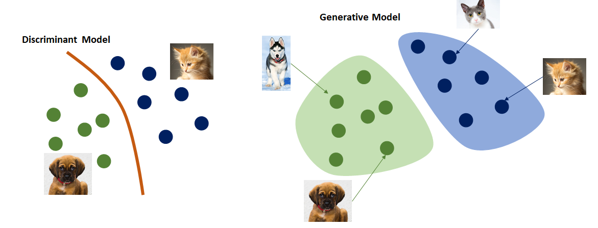
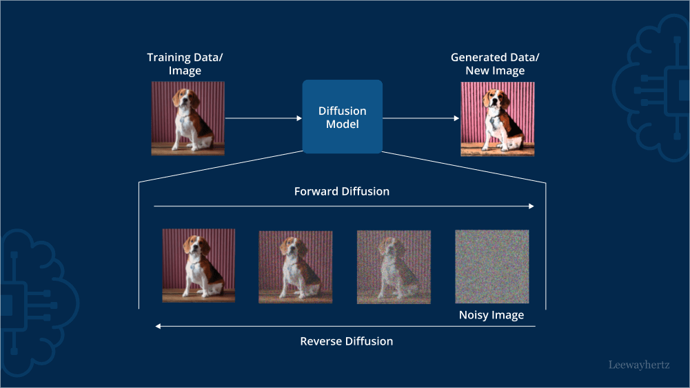

# Lecture 2: Introduction with tools

## 1- Classification:
Classification in machine learning is a supervised learning technique used to categorize data into predefined classes or labels.

It involves training a model on labeled data to predict the class of new, unseen data points. Essentially, the model learns patterns and relationships from the training data to accurately classify new inputs.
 

### Key aspects of classification:

**Supervised Learning**:  
Classification falls under supervised learning, meaning it requires a labeled dataset where the correct categories are known during training.

**Predictive Modeling:**
The goal is to build a model that can accurately predict the class of new, unseen data based on its features. 

**Categorical Output:**
Unlike regression, which predicts continuous values, classification predicts discrete categories or classes. 

 

## 2- Segmentation 

In machine learning, segmentation refers to the process of dividing a large dataset or an image into smaller, more manageable subsets or regions, called segments, based on specific criteria.

This division allows for more targeted analysis, improved model accuracy, and better decision-making. Segmentation is a fundamental technique in various machine learning tasks, including image analysis, customer relationship management, and data mining. 

Here's a breakdown of different aspects of segmentation in machine learning:

### 1. Data Segmentation:
**Definition:**  
Dividing a dataset into meaningful subgroups based on shared characteristics or behaviors.
 
**Purpose:**  
To enable more focused analysis, targeted strategies, and improved model performance by tailoring algorithms to specific segments. 
Examples:
Customer segmentation in marketing, where customers are grouped based on demographics, purchase history, or behavior. 

**Techniques:**  
Supervised, unsupervised, and semi-supervised learning methods can be used for data segmentation. 

### 2. Image Segmentation:

**Definition:**  
Partitioning a digital image into multiple segments or regions, where each segment represents a meaningful part of the image, like an object or a region. 

**Purpose:**  
To enable object detection, analysis, and understanding of visual data by identifying boundaries and characteristics of different elements within an image. 

**Examples:**  
Semantic segmentation, which assigns a class label to each pixel in an image (e.g., identifying roads, buildings, and trees in an aerial image). 

**Techniques:**  
Traditional image processing techniques and deep learning-based approaches are used for image segmentation. 

**Two examples are enough for now we will see more examples ahead!**

## 3 - Generative Models
Generative models are a broad category of ML models that can learn from data and then generate new data samples that look similar to the original data.

## 4 - Diffusion Models
Diffusion models are a type of generative model that generate data by starting from pure noise and then removing that noise step-by-step to form a realistic output.

## 5- Mods

An AI Model generally operates in two mods

- Training Mod
- Testing Mod

**Training Mod:**  
You will give data as input to model, model will be trained on it.
You would have an expected output and a actual output.
Actual output means correct output, the output that model will give you is called expected output.
You will compare actual output with expected output and give feedback to model and the model will imporve itself on your feedback.