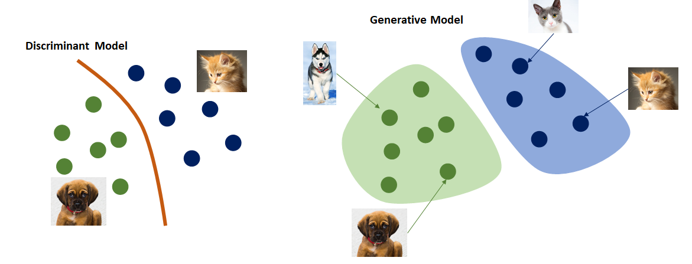

# Lecture 2: Introduction with tools

## Supervised Learning Techniques

### Classification:
Classification in machine learning is a supervised learning technique used to categorize data into predefined classes or labels.

It involves training a model on labeled data to predict the class of new, unseen data points. Essentially, the model learns patterns and relationships from the training data to accurately classify new inputs.
 

## Key aspects of classification:

**Supervised Learning**:  
Classification falls under supervised learning, meaning it requires a labeled dataset where the correct categories are known during training.

**Predictive Modeling:**
The goal is to build a model that can accurately predict the class of new, unseen data based on its features. 

**Categorical Output:**
Unlike regression, which predicts continuous values, classification predicts discrete categories or classes. 